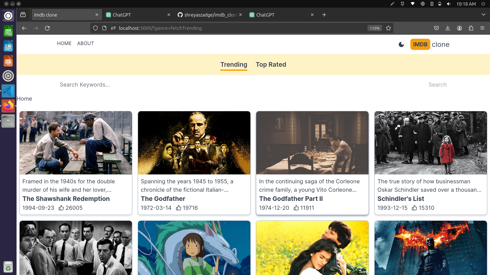
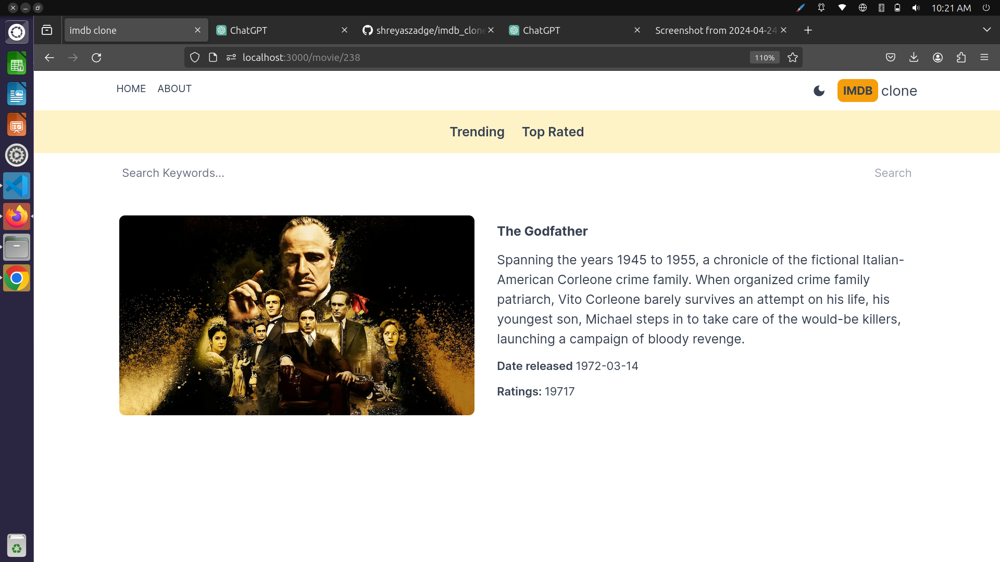
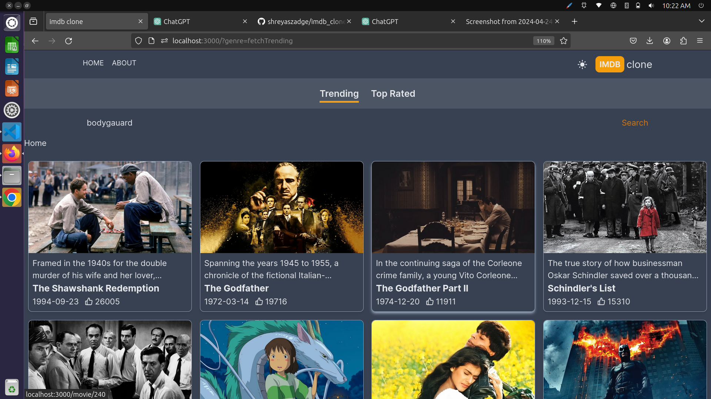
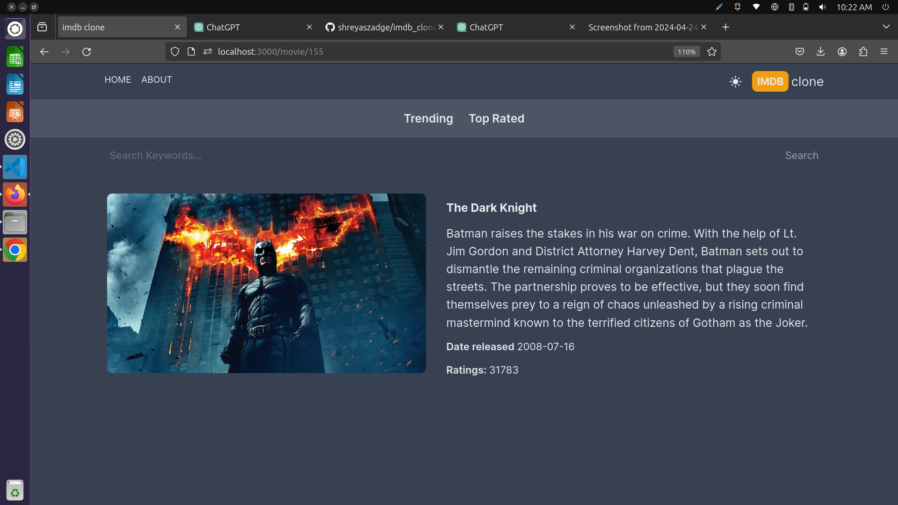

# IMDb Clone Project

This is a clone of the popular movie and TV show database website IMDb, built using Next.js.

## Description

This project aims to replicate the functionality and design of the IMDb website. It includes features such as browsing movies and TV shows, searching for specific titles, viewing details about individual titles, and more.

## Features

- Browse popular movies and TV shows
- Search for movies and TV shows by title
- View details about individual movies and TV shows
- Responsive design for seamless usage across different devices

## Screenshots
*Screenshot of the homepage White Mode*





*Screenshot of the homepage Dark Mode*





## Technologies Used

- Next.js
- React.js
- CSS (or SCSS, if applicable)
- IMDb API (or any other movie database API used)

## Getting Started


To get a local copy up and running follow these simple steps:

1. Clone the repository:
   ```sh
   git clone https://github.com/shreyaszadge/imdb_clone_project.git

2. cd imdb_clone_project
3.npm install
4.npm run dev
   
